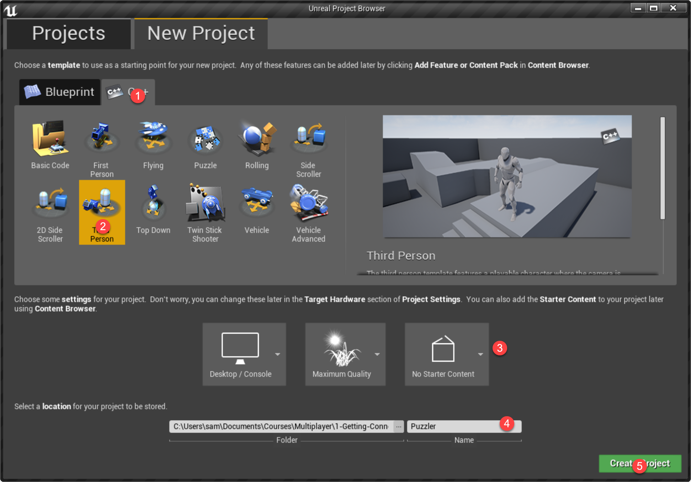
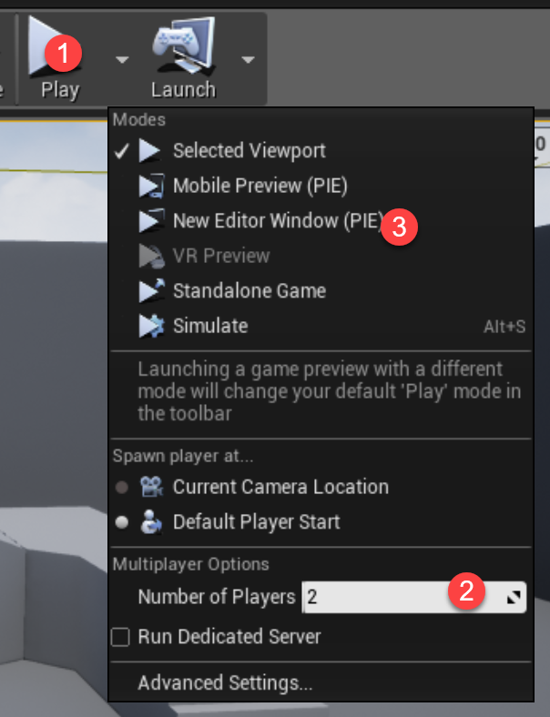
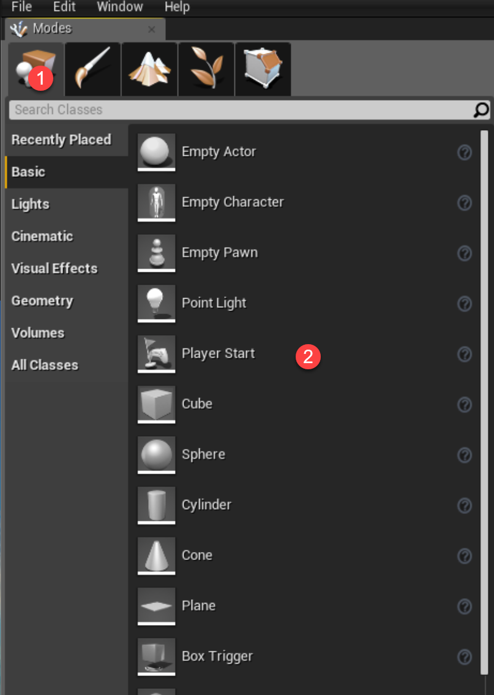

## Connecting Two Players

1. Create a 3rd person game

 

2. Play as two (or more) Players

 

3. Add more player starts

 

4. Need to add many to avoid clash probability

## Introducing the Client-Server model

1. Launch a game standalone:

 ```
 & "C:\Program Files\UE_4.16\Engine\Binaries\Win64\UE4Editor.exe" "C:\...\Puzzler\Puzzler.uproject" -game -log
 ```
2. Just run a dedicated server:

  ```
 & "C:\Program Files\UE_4.16\Engine\Binaries\Win64\UE4Editor.exe" "C:\...\Puzzler\Puzzler.uproject" /Game/ThirdPersonCPP/Maps/ThirdPersonExampleMap -server -log
 ```

3. Note what happens with a bad path.

4. Find you IP then launch:

 ```
 & "C:\Program Files\UE_4.16\Engine\Binaries\Win64\UE4Editor.exe" "C:\...\Puzzler\Puzzler.uproject" 192.168.1.90 -game -log
 ```

## Detecting Where The Code is Running

1. Create a StaticMesh actor.
2. Add movement logic (including mobility)
3. Only run with authority.

## Authority and Replication

1. Explain the authority and replication model.
1. Enable replication of movement.
2. Notice what happens when we only make change to client.
3. Explain the behaviour when client stands on the platform.

## Aside: Faster Build Times

1. Explain symbols, headers and linkers
2. How modules are just a DLL system.
2. Remove by process of elimination.

## Revision: Adding Vectors and Normalisation

1. Editable widget.
2. Revision of Vectors.
3. Direction and normalisation challenge.

## Revision: Vector Dot Products

1. What is a dot product.
2. Create the scheme.
3. Implement and factor.

## Creating a Simple Platform Puzzle

1. Better level layout.

 
2. Tweak the jumping movement.

 

## Setup a Platform Trigger

1. Create the C++ base
2. Add box component.
3. Tweak in BP child.
4. Place in the world.

## Enable Triggering Callbacks

1. Show one trigger.
2. Challenge the other.

## Activating Platforms from Triggers

1. Overview the desired behaviour
1. Create an activation int.
3. Create TArray for platforms.
4. For loop on trigger.
